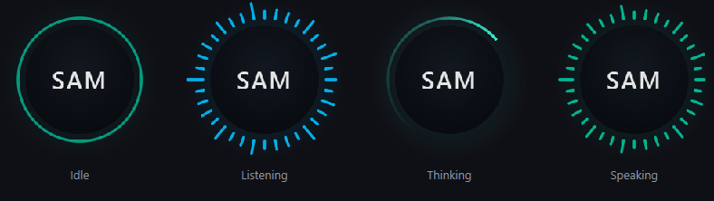
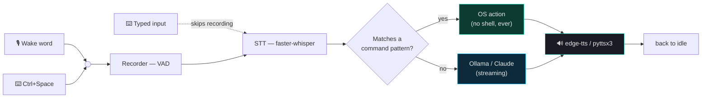

<div align="center">


# SAM — Smart Assistant Module

### A local, always-on voice assistant that lives on your desktop

<p>
  
  
  
  
  
</p>



<sub>The orb's four states — idle breathing, level-reactive listening, a sweeping thinking arc, speaking.</sub>

<br><br>

**[Setup Guide](setup.md)** · **[Architecture](docs/ARCHITECTURE.md)** · **[Roadmap](ROADMAP.md)**

</div>

---

## What SAM actually is

SAM is a Windows background app that sits on your desktop as a small circular **orb** —
out of the way until you need it, gone from the window stack, then instantly on top the
moment you speak, type, or click it.

> Say the wake word or press a hotkey → SAM records you → transcribes locally with
> `faster-whisper` → either runs a matching OS command directly, or streams a reply from a
> local **Ollama** model → speaks the answer back.

It's not a cloud assistant with a local UI bolted on. Voice, transcription, and — with
Ollama — the language model itself, all run on your machine. SAM's only unprompted network
call is to `localhost:11434` (your own Ollama server); a cloud fallback (Claude) is opt-in.

---

## ✨ What's new in v0.4.0

<table>
<tr>
<td width="50%" valign="top">

**🟢 The orb**
An always-on circle replaces the trigger-only floating bar. It breathes gently when idle
and reacts to your voice while engaged.

**⬇️ Out of your way, by default**
Sits at the very bottom of the window stack — below your other windows, above only the
wallpaper — until wake word, hotkey, or a click summons it to the front. Then sinks back
down. Configurable via `ui.orb.layer`.

**🖱️ Click-through**
Only the visible circle is clickable; everything else in its bounding box passes mouse
clicks straight to your desktop. `Ctrl` + drag moves it; position is remembered.

</td>
<td width="50%" valign="top">

**⌨️ Typed input**
`Ctrl+Shift+Space`, or a click on the orb, opens a text box under it — same
router → LLM → TTS pipeline as speech.

**🦙 Ollama auto-start**
SAM finds and starts the Ollama server itself, hidden, with no console flash. Never
touches a server you already had running.

**🛡️ A real safety fix**
SAM can no longer be told, by voice *or* text, to open a shell — see
[Security & Privacy](#-security--privacy).

**📦 A real installer**
`SAM-Setup-x.y.z.exe` — see the [Setup Guide](setup.md).

</td>
</tr>
</table>

---

## How it works



Everything is orchestrated by `AppController` (`core/app.py`) through PyQt signals — no
component calls another directly. See [`docs/ARCHITECTURE.md`](docs/ARCHITECTURE.md) for
the full picture, including the state machine, threading model, and the z-order mechanics
behind "out of your way until called."

| Stage | What runs |
|:--|:--|
| Wake word | `openwakeword` (ONNX), continuous, low CPU |
| Recording | RMS-based voice activity detection |
| Transcription | `faster-whisper` (CTranslate2, int8) |
| Instant commands | Regex router → `os.startfile` / `ctypes` / list-form `subprocess` — never a shell |
| Conversation | Local Ollama, or Claude if you configure it |
| Speech out | `edge-tts` (online voices) or `pyttsx3` (fully offline) |
| Overlay | Always-on orb + fading caption + typed-input box |

---

## 🚀 Installation

> [!TIP]
> Most people should grab the installer. Full walkthrough — including what each checkbox
> does — in the **[Setup Guide](setup.md)**.

<table>
<tr><th>📦 Installer (recommended)</th><th>🛠️ From source (development)</th></tr>
<tr>
<td valign="top">

```
SAM-Setup-x.y.z.exe
```

Per-user install, no admin needed. Optionally
installs Ollama, pre-pulls the model, pre-downloads
the speech model, and adds a startup entry.

</td>
<td valign="top">

```powershell
git clone https://github.com/sametgurtuna/SAM.git
cd SAM
python -m venv venv
.\venv\Scripts\Activate.ps1
pip install -r requirements.txt

ollama pull qwen2.5:3b
python main.py
```

</td>
</tr>
</table>

No build step for source use — it's a script you run directly. `config.yaml` is created
from `config.example.yaml` on first run if it doesn't already exist.

---

## 🎮 Using SAM

| Method | Result |
|:--|:--|
| Say **"Hey Sam"** (default wake word) | Orb lights up, starts listening |
| Press `Ctrl+Space` | Same, no wake word needed |
| Press `Ctrl+Shift+Space` | Opens a text box under the orb instead |
| Click the orb | Same as the text hotkey |
| `Ctrl` + drag the orb | Moves it — position is remembered |
| Right-click the tray icon | Settings, mute wake word, clear memory, "Ask SAM…", quit |

---

## ⌨️ Command reference

Matches here execute directly — no LLM round-trip, response in milliseconds. Everything
else falls through to the local LLM.

<table>
<tr><th>Category</th><th>Examples</th></tr>
<tr><td>Launch / close apps</td><td><code>"open spotify"</code> · <code>"launch notepad"</code> · <code>"close discord"</code></td></tr>
<tr><td>Volume</td><td><code>"volume up"</code> · <code>"set volume to 50"</code> · <code>"mute"</code></td></tr>
<tr><td>Media</td><td><code>"play"</code> · <code>"pause"</code> · <code>"next track"</code></td></tr>
<tr><td>Spotify search ¹</td><td><code>"play blinding lights on spotify"</code></td></tr>
<tr><td>Window / session</td><td><code>"minimize all"</code> · <code>"lock screen"</code></td></tr>
<tr><td>Power ²</td><td><code>"shutdown computer"</code> · <code>"restart computer"</code></td></tr>
<tr><td>Web</td><td><code>"go to github.com"</code> · <code>"search for local weather"</code></td></tr>
<tr><td>Screenshot</td><td><code>"take a screenshot"</code></td></tr>
</table>

> ¹ Needs a Spotify Client ID/Secret — Settings → Integrations, or the
> `SPOTIFY_CLIENT_ID` / `SPOTIFY_CLIENT_SECRET` environment variables (these win). The
> OAuth token is cached in `%LOCALAPPDATA%\SAM\`, never in the project folder.
>
> ² **Two-step by design.** `"shutdown computer"` only arms the action and starts a
> 30-second countdown; say `"confirm"` to execute it, `"cancel"` to abort. The phrase
> must name an explicit object (`computer`/`pc`/`machine`/`laptop`), so
> `"restart chrome"` goes to the app handler, never the power handler.

**Shells cannot be opened by voice or text, on purpose** — see below.

---

## ⚙️ Configuration

Every key in `config.yaml` has a default in `core/config.py`, so a missing or partial file
never breaks the app. Edit it via **Settings** in the tray menu (Orb-tab cosmetics —
size, opacity, fps, click-through, layer, auto-hide delay — apply live; everything else
needs a restart), or directly — the full annotated template is
[`config.example.yaml`](config.example.yaml).

```yaml
hotkey:
  trigger: ctrl+space          # hold to speak
  text_input: ctrl+shift+space # open the typed-input box

ui:
  orb:
    layer: auto        # auto (bottom until called, then on top) | topmost | normal
    click_through: true
    idle_animation: true
    idle_fps: 12        # SAM runs 24/7 — this is what it costs while idle
    active_fps: 60

wake_word:
  model: assets/models/hey_sam.onnx
  threshold: 0.5        # lower = triggers more easily

stt:
  model: small           # tiny | base | small | medium | large-v3
  device: cpu             # or cuda, with a working CUDA + cuDNN setup

llm:
  ollama:
    model: qwen2.5:3b
    autostart: true       # SAM starts "ollama serve" itself if it isn't running
    stop_on_exit: false   # never kill a server you already had running
```

---

## 🧩 Writing a custom command

A regex in `commands/router.py` plus a handler in `commands/system.py` (or a new module)
that returns a spoken-style confirmation string.

```python
# commands/router.py — inside _build_patterns()
patterns.append((
    re.compile(r"\b(what'?s|check) (my )?cpu (temp|temperature)\b", re.IGNORECASE),
    lambda m: system.get_cpu_temperature()
))
```

```python
# commands/system.py
def get_cpu_temperature() -> str:
    """Handlers never raise — the router already wraps calls in try/except,
    but a clean string beats a caught traceback."""
    try:
        # Real OS side effects go through list-form subprocess or os.startfile —
        # never shell=True, and never pass transcript text into a shell.
        ...
        return f"Your CPU is at {celsius:.1f} degrees."
    except Exception:
        return "Sorry, I couldn't read the CPU temperature."
```

See [`CLAUDE.md`](CLAUDE.md)'s **Conventions** for the full rule set this codebase
follows — no `shell=True`, destructive actions are two-step and anchored, secrets come
from the environment first.

---

## 🚑 Troubleshooting

| Symptom | Likely cause | Fix |
|:--|:--|:--|
| `No LLM engine found` in the log | Ollama isn't installed, or the model isn't pulled | Check the log for "Ollama is not installed"; otherwise `ollama pull qwen2.5:3b` |
| Wake word doesn't trigger | Threshold too high, or wrong mic | Lower `wake_word.threshold` (try `0.35`); check your default input device |
| Whisper transcribes garbage on silence | Known Whisper hallucination behavior on background noise | Raise `audio.silence_threshold` — also why shells can't be voice-opened, see below |
| `Ctrl+Space` does nothing | `keyboard` needs to see other apps' keystrokes | Run SAM as Administrator, or check `logs/sam.log` for a hotkey error |
| A second orb / doubled hotkeys | Two SAM processes running | SAM allows one instance only (named mutex) — check the tray before starting another |
| Settings won't save | Installed build's config lives in `%APPDATA%\SAM\config.yaml`, not next to the exe | Edit that file, or use the Settings window |

Logs: `logs/sam.log` from source, `%APPDATA%\SAM\logs\sam.log` when installed.

---

## 📂 Project layout

```
SAM/
├── assets/                    icon, activation chime, wake word model
├── audio/                     wake word · recorder (VAD) · STT · TTS
├── commands/                  regex router + OS side effects
├── core/
│   ├── app.py                   AppController — the state machine, wires everything together
│   ├── config.py                DEFAULTS + config.yaml loader/saver
│   ├── paths.py                 dev vs. frozen-exe path resolution, single-instance lock
│   ├── code_parser.py           extracts ```code``` blocks from LLM replies to the Desktop
│   └── installer_steps.py       `SAM.exe --install-models` — used by the installer
├── llm/                        LLMEngine base + Ollama/Claude engines + router + OllamaService
├── ui/
│   ├── orb.py · caption.py · text_input.py · overlay.py     the always-on overlay
│   ├── win32.py                 click-through, z-order, foreground-focus ctypes helpers
│   ├── floating_bar.py          legacy bottom bar (ui.overlay.style: bar)
│   └── settings_window.py · tray.py · styles.py · waveform.py
├── installer/SAM.iss          Inno Setup script
├── tools/make_icon.py         regenerates assets/icon.ico from the orb design
├── SAM.spec                   PyInstaller build spec
├── config.example.yaml        committed template — config.yaml is gitignored
├── docs/ARCHITECTURE.md
├── setup.md
└── main.py
```

---

## 🛡️ Security & Privacy

- **No shell, ever, from voice or text.** faster-whisper occasionally hallucinates short
  phrases from silence or background noise. If that hallucination ever contained something
  like "open command prompt," earlier versions of SAM would have genuinely opened one — a
  real terminal window appearing for no reason is exactly what makes an always-listening
  assistant feel unsafe. `cmd`, `powershell`, `wt`, `bash`, and friends are hard-blocked in
  `commands/system.py`, regardless of how the request arrives.
- **Destructive actions are two-step.** `shutdown`/`restart` only arm; a separate
  `"confirm"` executes, within a 30-second window.
- **Transcripts never reach a shell.** All OS actions use `os.startfile()` or list-form
  `subprocess` — never `shell=True`.
- **No telemetry.** SAM's only self-initiated network calls are to your local Ollama
  server, Spotify (only if configured), and edge-tts (only if you use it instead of the
  fully offline `pyttsx3`). Claude is opt-in only.
- **Audio isn't written to disk** — processed in memory, discarded after transcription.
- **Secrets stay out of the repo.** `config.yaml` is gitignored; API keys are read from
  the environment first. OAuth caches live in `%LOCALAPPDATA%\SAM\`, and the PyInstaller
  build refuses to bundle either.

---

## 🤝 Contributing

1. Fork and branch: `git checkout -b feature/whatever`
2. Follow [`CLAUDE.md`](CLAUDE.md) — English identifiers/docstrings, Turkish in-line
   comments (existing convention), config access through `config.get(...)`, no `shell=True`.
3. No test suite — verify manually with `python main.py` and `logs/sam.log`.
4. Open a PR describing what changed and how you tested it.

---

## 📜 License

MIT — see [LICENSE](LICENSE).

<div align="center">

*Keep your data local.*

</div>
