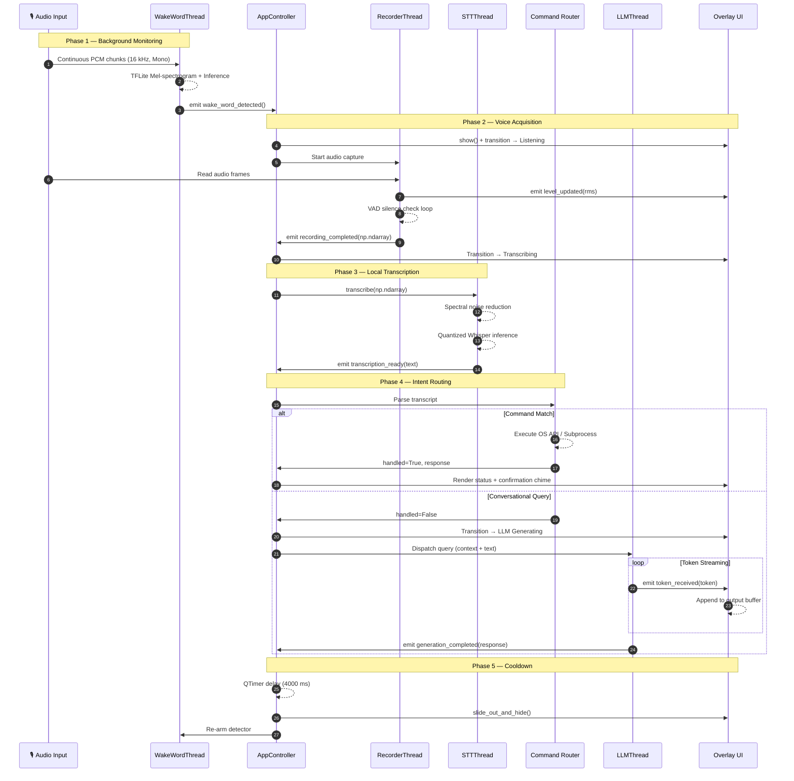
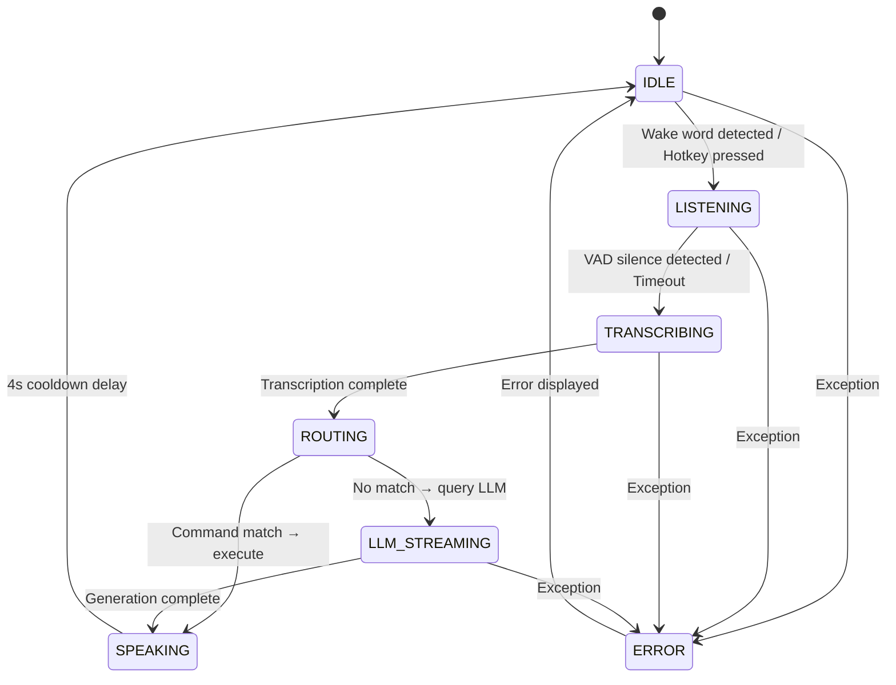

<div align="center">

# 🏗️ SAM — Architecture & Developer Guide

**Internal technical documentation for core developers, security auditors, and contributors.**

</div>

---

## Table of Contents

1. [System Philosophy](#1-system-philosophy)
2. [Global Pipeline Architecture](#2-global-pipeline-architecture)
3. [Subsystem Deep-Dive](#3-subsystem-deep-dive)
4. [State Machine Definition](#4-state-machine-definition)
5. [Multi-Threading & Concurrency](#5-multi-threading--concurrency-constraints)
6. [Memory Profile & Optimization](#6-memory-profile--optimization)
7. [Class Structure & Interface Reference](#7-class-structure--interface-reference)
8. [Architectural Roadmap](#8-architectural-roadmap)

---

## 1. System Philosophy

Traditional desktop assistant architectures rely on heavy web-views, external cloud APIs, or synchronous loops that block the user interface. SAM was designed to solve three fundamental challenges:

| Challenge | SAM's Approach |
|:---|:---|
| **Zero-Latency Execution** | Simple commands (volume, app launch) bypass the LLM entirely, executing native OS commands in **< 10 ms** |
| **Minimal Resource Overhead** | Memory optimization via quantized weights (`int8`), lazy loading, and efficient threading minimizes background resource usage |
| **UI Fluidity** | Heavy processing (audio analysis, noise cancellation, AI inference) never blocks the GUI thread — strict multi-threaded separation |

---

## 2. Global Pipeline Architecture

The entire lifecycle of a user interaction is managed centrally by the `AppController` ([core/app.py](../core/app.py)). Communication between UI, audio hardware, transcription models, and execution layers is governed by **PyQt Signals and Slots** — a fully decoupled, event-driven pattern.

### Subsystem Flow Diagram



---

## 3. Subsystem Deep-Dive

### 3.1 Audio Acquisition & DSP

> Located in `audio/` — interfaces with native audio drivers via `sounddevice` and `numpy`.

#### Wake Word Detector — `audio/wake_word.py`

Runs continuously on a dedicated daemon thread:
- Samples audio input at **16,000 Hz** (mono)
- Slices incoming buffers into **1280-sample blocks**
- Feeds blocks to an `openwakeword` pre-trained `.tflite` model
- Mel-spectrogram generation and predictions execute in-memory
- When confidence values exceed the configured threshold → emits Qt signal

#### Voice Activity Detector — `audio/recorder.py`

When activated, the recorder opens a high-fidelity input channel. For each 100 ms chunk, it calculates Root Mean Square (RMS) energy:

$$\text{RMS} = \sqrt{\frac{1}{N} \sum_{i=1}^{N} x_i^2}$$

| Parameter | Default | Description |
|:---|:---|:---|
| `silence_threshold` | 350 | RMS below this → considered silence |
| `silence_duration_ms` | 1800 ms | Contiguous silence duration before auto-stop |
| `max_record_seconds` | 30 s | Hard cutoff for memory protection |

When silence is detected, the audio loop terminates and returns a **32-bit float NumPy array**.

---

### 3.2 Speech-to-Text Engine

> Located in `core/stt.py`

| Stage | Technology | Purpose |
|:---|:---|:---|
| Noise Reduction | `noisereduce` | Spectral gating — profiles initial frames to subtract ambient noise |
| Model Execution | `faster-whisper` (CTranslate2) | `int8` quantized models — 75% smaller, AVX-512 optimized |
| Decoder Biasing | `initial_prompt` injection | Primes cross-attention layers toward command keywords |

**Decoder Biasing** is critical for accuracy: the Whisper model is initialized with an `initial_prompt` containing key command vocabularies (*"open, close, volume, mute, lock screen, shutdown"*). This steers the output toward these keywords even with heavy non-native accents.

---

### 3.3 Command Router Engine

> Located in `commands/router.py` and `commands/system.py`

**Regex Intent Matching** — Transcription output is evaluated against regex pattern maps instead of wasting compute on LLM classification. The matcher handles common phonetic variations (e.g., "mute" → "muth", "mut").

**Direct OS API Execution** — Once matched, actions route to native APIs:

```python
import ctypes

# Ses kapat / aç — Virtual Key Code VK_VOLUME_MUTE
ctypes.windll.user32.keybd_event(0xAD, 0, 0, 0)  # Key Down
ctypes.windll.user32.keybd_event(0xAD, 0, 2, 0)  # Key Up
```

**Application Control** — Uses `subprocess.Popen` with custom flags (`CREATE_NO_WINDOW`) to launch or terminate software without blocking the main event thread.

---

### 3.4 Local LLM Connector

> Located in `llm/ollama_client.py`

**Engine Health Validation**

On initialization, SAM polls the Ollama API:

```
GET http://localhost:11434/api/tags
```

If the request times out within 2 seconds, SAM checks environment variables (`ANTHROPIC_API_KEY`, `OPENAI_API_KEY`) for cloud fallback.

**Conversation State Deque**

```python
from collections import deque

# Son 5 mesaj döngüsüne kısıtlanmış FIFO bellek kuyruğu
context_history = deque(maxlen=5)
```

This keeps LLM prompt sizes small, reducing VRAM usage and keeping response times fast.

**Chunked HTTP Streams**

The LLM runner makes a streaming POST to `/api/generate`, reading chunked NDJSON block-by-block. Each parsed token is dispatched via Qt signals directly to the UI overlay for real-time display.

---

### 3.5 PyQt6 Overlay UI

> Located in `ui/floating_bar.py` and `ui/waveform.py`

**Window Composition Flags:**

```python
from PyQt6.QtCore import Qt

self.setWindowFlags(
    Qt.WindowType.FramelessWindowHint      # İşletim sistemi pencere kenarlıklarını kaldırır
    | Qt.WindowType.WindowStaysOnTopHint   # Tüm pencerelerin üstünde tutar
    | Qt.WindowType.Tool                    # İşletim sistemi görev çubuğundan gizler
)
self.setAttribute(Qt.WidgetAttribute.WA_TranslucentBackground)  # Arka planı şeffaf yapar
```

**Waveform Rendering:**

The visualizer overrides the `paintEvent` method of `WaveformWidget`. It uses `QPainter` to draw antialiased lines. When the recorder emits the microphone's current RMS level, the widget scales waveform bar heights using a smoothing factor — providing a clean, reactive visualization mapped directly to user speech.

---

## 4. State Machine Definition

SAM uses a centralized state machine to ensure consistent behavior across threads:



| State | Description | Transition |
|:---|:---|:---|
| `STATE_IDLE` | Background daemon listening. UI hidden. | → `LISTENING` on wake word or hotkey |
| `STATE_LISTENING` | UI visible. Microphone buffer active. | → `TRANSCRIBING` on VAD silence or timeout |
| `STATE_TRANSCRIBING` | Audio processed by Whisper STT. | → `ROUTING` on transcription complete |
| `STATE_ROUTING` | Command Router checks transcript against regex intents. | → `SPEAKING` if match; → `LLM_STREAMING` otherwise |
| `STATE_LLM_STREAMING` | Query sent to local LLM. Responses stream to UI. | → `SPEAKING` on generation complete |
| `STATE_SPEAKING` | Response synthesized or chime played. | → `IDLE` after 4-second delay |
| `STATE_ERROR` | Exception occurred (LLM offline, audio device busy). | → `IDLE` after error message |

---

## 5. Multi-Threading & Concurrency Constraints

Python's Global Interpreter Lock (GIL) prevents multiple native threads from executing Python bytecodes simultaneously. SAM uses a multi-threaded architecture to keep the GUI thread free:

```
┌──────────────────────────────────────────────────────────────────────┐
│ MAIN SYSTEM RUNTIME (Python Process)                                │
│                                                                      │
│  ┌────────────────────────────────────────────────────────────────┐  │
│  │ Main GUI Thread (PyQt6 Event Loop)                            │  │
│  │ • UI render loop (60 FPS waveform paint)                      │  │
│  │ • Window slide-in / slide-out animations                      │  │
│  │ • Receives async Qt Signals to update text                    │  │
│  └──────────┬──────────────┬───────────────┬──────────────┬──────┘  │
│             │ Qt Signal    │ Qt Signal     │ Qt Signal    │ Signal  │
│  ┌──────────▼──────┐  ┌───▼──────────┐  ┌─▼────────────┐ ┌▼──────┐ │
│  │ WakeWord Thread │  │ Recorder     │  │ STT Engine   │ │ LLM   │ │
│  │ • TFLite WW     │  │ • Audio VAD  │  │ • Noise gate │ │ Thread│ │
│  │   inference     │  │   capture    │  │ • Whisper    │ │• HTTP │ │
│  │ • Daemon worker │  │ • Active     │  │   inference  │ │  stream││
│  └─────────────────┘  └──────────────┘  └──────────────┘ └───────┘ │
└──────────────────────────────────────────────────────────────────────┘
```

### Thread Implementation Rules

| Rule | Rationale |
|:---|:---|
| **Never modify UI from background threads** | PyQt6 widgets are not thread-safe. UI mutations from worker threads cause memory corruption. Use `pyqtSignal` exclusively. |
| **Use daemon workers** | Wake word detection and similar threads run as daemons — auto-shutdown when the main application closes. |
| **Prevent CPU overhead** | Background threads use small sleep intervals (`time.sleep(0.01)`) to avoid CPU spikes. |

---

## 6. Memory Profile & Optimization

SAM is optimized for standard desktop environments:

| Optimization | Details |
|:---|:---|
| **Lazy Model Loading** | Whisper models load only on first activation, keeping initial footprint at ~110 MB RAM |
| **Float16 Support** | When NVIDIA GPUs are available (`cuda` device mode), STT runs in `float16` — reducing VRAM usage |
| **Audio Buffer Cleanup** | Recordings are processed as temporary NumPy arrays, cleared immediately after transcription to prevent memory leaks |

---

## 7. Class Structure & Interface Reference

### Class Diagram

```
┌───────────────────────────────────────────────────────────────────┐
│ AppController (core/app.py)                                       │
│ ─────────────────────────────────────────────────────────────────  │
│ Fields:                                                           │
│   state: StateEnum                                                │
│   ui_window: FloatingBarWindow                                    │
│ Signals:                                                          │
│   state_changed(new_state)                                        │
│ Methods:                                                          │
│   + start_assistant() → None                                      │
│   + handle_wake_word_detected() → None                            │
│   + handle_recording_completed(audio: np.ndarray) → None          │
│   + handle_transcription_ready(text: str) → None                  │
│   + execute_routing(transcript: str) → None                       │
└────────────┬───────────────────┬────────────────────┬─────────────┘
             │                   │                    │
             ▼                   ▼                    ▼
┌────────────────────┐ ┌────────────────────┐ ┌────────────────────┐
│ WakeWordDetector   │ │ AudioRecorder      │ │ STTEngine          │
│ (audio/wake_word)  │ │ (audio/recorder)   │ │ (core/stt)         │
│ ────────────────── │ │ ────────────────── │ │ ────────────────── │
│ ww_model: TFLite   │ │ silence_limit: f   │ │ model: Whisper     │
│ ────────────────── │ │ ────────────────── │ │ ────────────────── │
│ Signals:           │ │ Signals:           │ │ Methods:           │
│  wake_word_detected│ │  level_updated(rms)│ │  transcribe(audio) │
│ Methods:           │ │  recording_done()  │ │  clean_noise()     │
│  run()             │ │ Methods:           │ │                    │
│  stop()            │ │  record_voice_vad()│ │                    │
│                    │ │  get_rms()         │ │                    │
└────────────────────┘ └────────────────────┘ └────────────────────┘
```

### Module Reference

#### `AppController` — `core/app.py`

The central coordinator. Manages overlay UI lifecycle, initializes worker threads, and routes data between subsystems.

| Member | Type | Description |
|:---|:---|:---|
| `state_changed(new_state)` | Signal | Fired on state transitions |
| `start_assistant()` | Method | Initializes setup, checks Ollama, spawns wake word thread |
| `handle_wake_word_detected()` | Method | Triggered by wake-word thread; plays chime, transitions to listening |

#### `WakeWordDetector` — `audio/wake_word.py`

Monitors audio input for the wake word *"Hey Jarvis"*.

| Member | Type | Description |
|:---|:---|:---|
| `wake_word_detected` | Signal | Emitted when confidence score exceeds threshold |
| `run()` | Method | Core loop — continuous audio read + TFLite inference |

#### `AudioRecorder` — `audio/recorder.py`

Handles active recording after trigger, with VAD-based auto-stop.

| Member | Type | Description |
|:---|:---|:---|
| `level_updated(rms_value)` | Signal | Real-time volume metrics for UI visualizer |
| `recording_completed(audio_array)` | Signal | Final recorded buffer as NumPy array |

#### `STTEngine` — `core/stt.py`

Audio preprocessing and speech-to-text transcription.

| Member | Type | Description |
|:---|:---|:---|
| `transcribe(audio_data)` | Method | Runs noise gating + Whisper decoding on audio buffer |

#### `CommandRouter` — `commands/router.py`

Parses transcription for local system commands before LLM routing.

| Member | Type | Description |
|:---|:---|:---|
| `route_intent(text)` | Method | Regex match → execute action → return `True` if handled |

---

## 8. Architectural Roadmap

Future architectural improvements planned for SAM:

| Initiative | Description |
|:---|:---|
| **Cross-Platform OS Interfaces** | Port Windows-specific API calls in `commands/system.py` to macOS (PyObjC) and Linux (DBus, systemd) |
| **Local TTS Integration** | Replace remote TTS APIs with fast, offline synthesis (Piper or Coqui) running on a separate background process |
| **Multi-Processing for GIL Bypass** | Move Whisper transcription and LLM inference into separate system processes via `multiprocessing` — bypassing GIL for better multi-core performance |

---

<div align="center">

*For usage and setup instructions, see the [README](../README.md) and [Setup Guide](../setup.md).*

</div>
