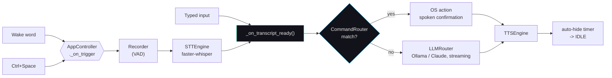
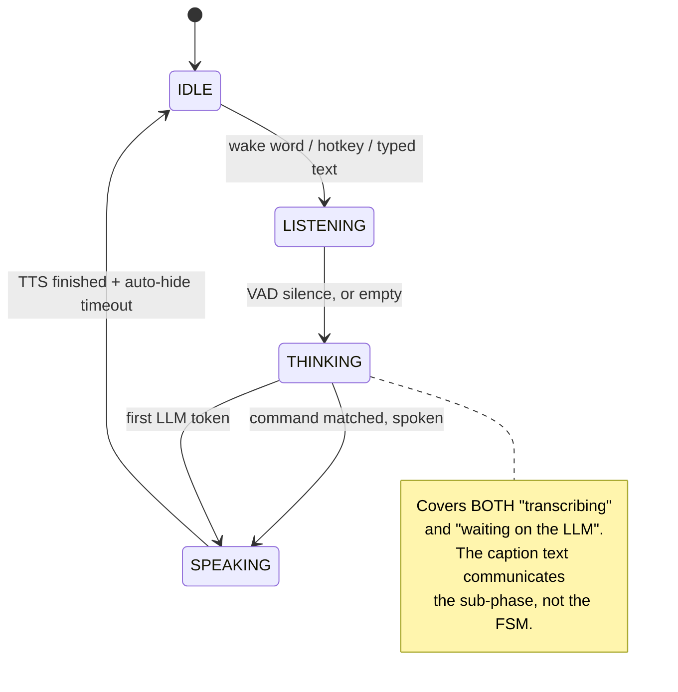
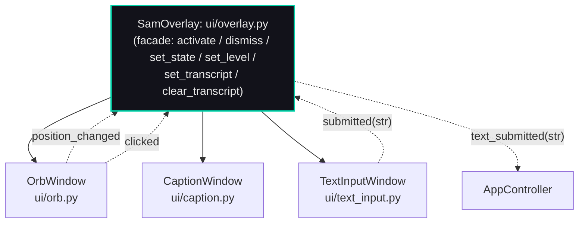
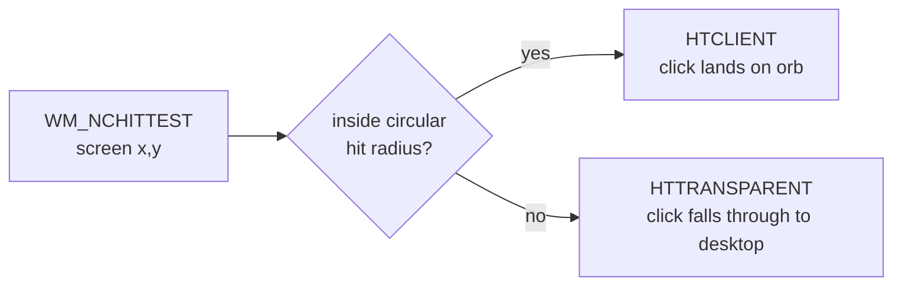
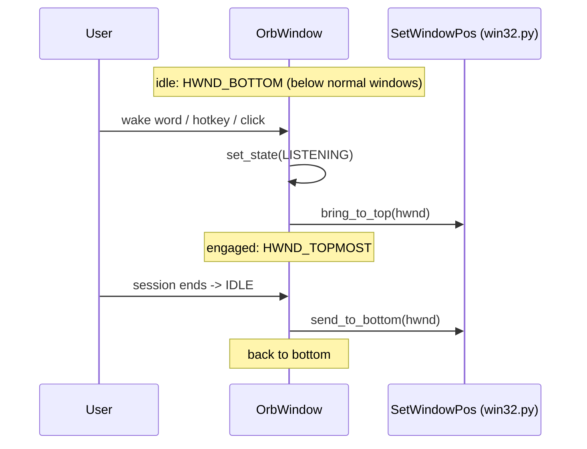
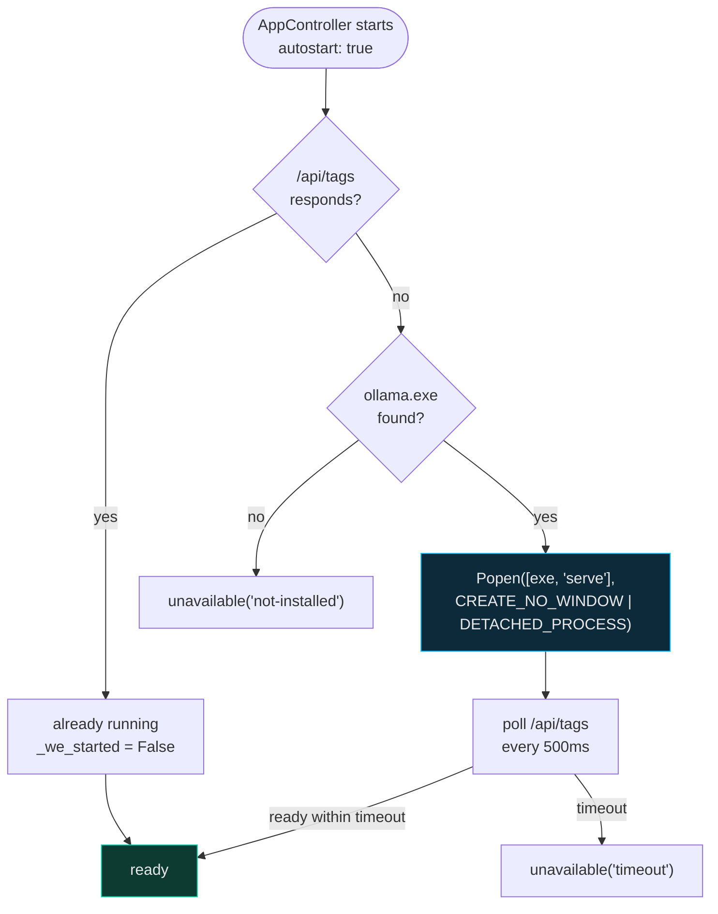
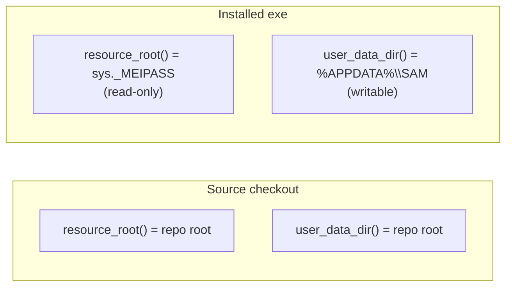
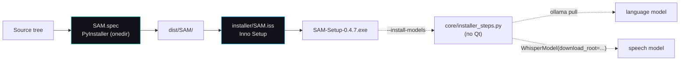

# SAM Architecture

**Internal technical reference.** Trust this and the source over anything else if they disagree: this file is kept close to the code, but the code always wins.

  
  
  

---

## Contents

1. [Orchestration model](#1-orchestration-model)
2. [Pipeline](#2-pipeline)
3. [State machine](#3-state-machine)
4. [Threading](#4-threading)
5. [The overlay](#5-the-overlay)
6. [Ollama lifecycle](#6-ollama-lifecycle)
7. [Paths: dev vs. frozen exe](#7-paths-dev-vs-frozen-exe)
8. [Single-instance guard](#8-single-instance-guard)
9. [Packaging](#9-packaging)
10. [Module reference](#10-module-reference)

---

## 1. Orchestration model

Everything is wired together by **`AppController`** (`core/app.py`), a `QObject` that owns
every engine and connects them purely through PyQt signals/slots.

```mermaid
flowchart TB
    subgraph AC["AppController: core/app.py"]
        direction TB
        STATE["_state: AppState"]
    end

    WW["WakeWordEngine"] -- "detected(audio)" --> AC
    REC["Recorder"] -- "recording_done(np.ndarray)\nlevel_update(float)" --> AC
    STT["STTEngine"] -- "transcript_ready(str)\npartial_transcript(str)" --> AC
    LLM["LLMRouter"] -- "token_received(str)\ngeneration_complete(str)\ngeneration_error(str)" --> AC
    TTS["TTSEngine"] -- "playback_finished()" --> AC
    OV["SamOverlay"] -- "text_submitted(str)" --> AC

    AC -- "direct method calls\n(activate/set_state/...)" --> OV
    AC -- "start() / speak() / generate()" --> WW & REC & STT & LLM & TTS

    style AC fill:#12121a,stroke:#00D4AA,stroke-width:2px,color:#e8e8e8
```

**No engine calls another engine directly**: `WakeWordEngine` does not know `Recorder`
exists; `STTEngine` does not know about `LLMRouter`. `AppController` is the only component
that knows the whole pipeline, and `AppController._set_state()` is the only place UI state
changes. This is the file to read first when tracing any feature end to end.

---

## 2. Pipeline

```mermaid
flowchart LR
    A["Wake word"] --> D{{"AppController\n._on_trigger"}}
    B["Ctrl+Space"] --> D
    C["Typed input"] --> E["_on_transcript_ready()"]

    D --> R["Recorder\n(VAD)"]
    R --> S["STTEngine\nfaster-whisper"]
    S --> E

    E --> M{"CommandRouter\nmatch?"}
    M -- "yes" --> H["OS action\nspoken confirmation"]
    M -- "no" --> L["LLMRouter\nOllama / Claude, streaming"]

    H --> T["TTSEngine"]
    L --> T
    T --> I["auto-hide timer\n-> IDLE"]

    style E fill:#12121a,stroke:#00D4AA,color:#e8e8e8
    style M fill:#12121a,stroke:#00BFFF,color:#e8e8e8
```

Three entry points converge on the same downstream pipeline. **Typed input**
(`Ctrl+Shift+Space`, or clicking the orb) skips recording/STT entirely:
`AppController.submit_text()` sets state to `THINKING` and calls
`_on_transcript_ready()` directly - the exact method the STT pipeline calls - so command
routing and LLM generation behave identically whether the words came from a microphone or
a keyboard.

> **Streaming TTS.** The LLM response is spoken while it is still generating.
> `_flush_streaming_tts()` watches the accumulating token buffer and hands each completed
> sentence to `TTSEngine.speak_chunk()`; `_on_llm_complete` sends whatever prose is left and
> calls `end_stream()`. `TTSEngine` is a queue plus one persistent worker thread.
> `playback_finished` fires once per utterance, on the `end` marker, not per chunk. A
> code fence in the stream stops streaming speech for that turn
> (`core/code_parser.py` writes the code to the Desktop instead; it is never read aloud).

---

## 3. State machine

`AppState` is four plain string constants:

```mermaid
stateDiagram-v2
    [*] --> IDLE
    IDLE --> LISTENING: wake word / hotkey / typed text
    LISTENING --> THINKING: VAD silence, or empty
    THINKING --> SPEAKING: command matched, spoken
    THINKING --> SPEAKING: first LLM token
    SPEAKING --> IDLE: TTS finished + auto-hide timeout

    note right of THINKING
        Covers BOTH "transcribing"
        and "waiting on the LLM".
        The caption text communicates
        the sub-phase, not the FSM.
    end note
```

`AppController._set_state()` is the single funnel: it updates `self._state` and calls
`self._bar.set_state(new_state)` - nothing else touches overlay state directly.

---

## 4. Threading

```mermaid
flowchart TB
    subgraph MAIN["Qt main thread"]
        UI["Overlay paint / animation timers"]
        SIG["Signal handlers in AppController"]
    end

    subgraph WORKERS["daemon threading.Thread: one per engine"]
        T1["WakeWordEngine"]
        T2["Recorder"]
        T3["STTEngine"]
        T4["TTSEngine worker"]
        T5["OllamaEngine / ClaudeEngine"]
        T6["OllamaService.ensure_running"]
        T7["LLMRouter.refresh_engine"]
    end

    T1 -. "pyqtSignal only" .-> SIG
    T2 -. "pyqtSignal only" .-> SIG
    T3 -. "pyqtSignal only" .-> SIG
    T4 -. "pyqtSignal only" .-> SIG
    T5 -. "pyqtSignal only" .-> SIG
    T6 -. "pyqtSignal only" .-> SIG
    T7 -. "pyqtSignal only" .-> SIG

    style MAIN fill:#0d1420,stroke:#00BFFF
    style WORKERS fill:#0d1a16,stroke:#00D4AA
```

Every engine that blocks does its work on a daemon thread and reports back to the Qt main
thread **exclusively** via `pyqtSignal`. Never touch a PyQt widget from inside one of
these threads.

`LLMRouter` engine detection runs via `QTimer.singleShot(0, refresh_engine)` at startup and
never probes synchronously on the hot path. Redetection is driven asynchronously by
`OllamaService.ready` or connection error heuristics.

---

## 5. The overlay

```mermaid
flowchart TB
    OV["SamOverlay: ui/overlay.py\n(facade: activate / dismiss / set_state / set_level /\nset_transcript / clear_transcript)"]
    OV --> ORB["OrbWindow\nui/orb.py"]
    OV --> CAP["CaptionWindow\nui/caption.py"]
    OV --> INP["TextInputWindow\nui/text_input.py"]

    ORB -. "position_changed" .-> OV
    ORB -. "clicked" .-> OV
    INP -. "submitted(str)" .-> OV
    OV -. "text_submitted(str)" .-> AC["AppController"]

    style OV fill:#12121a,stroke:#00D4AA,stroke-width:2px,color:#e8e8e8
```

Four top-level windows, one facade. `activate()` energises the ring
and fades the caption in; `dismiss()` fades the caption back out and lets the orb settle
to breathing. The orb itself never hides during a normal session.

### Click-through and circular hit-test

```mermaid
flowchart LR
    M["WM_NCHITTEST\nscreen x,y"] --> D{"inside circular\nhit radius?"}
    D -- yes --> C["HTCLIENT\nclick lands on orb"]
    D -- no --> T["HTTRANSPARENT\nclick falls through to desktop"]
```

`OrbWindow.nativeEvent()` intercepts `WM_NCHITTEST` and returns `HTTRANSPARENT` for every
point outside its circular hit radius, and `HTCLIENT` inside it: so clicks pass through
everywhere except the visible disc.

### Z-order: the `auto` layer

```mermaid
sequenceDiagram
    participant User
    participant Orb as OrbWindow
    participant Win as SetWindowPos (win32.py)

    Note over Orb: idle: HWND_BOTTOM (below normal windows)
    User->>Orb: wake word / hotkey / click
    Orb->>Orb: set_state(LISTENING)
    Orb->>Win: bring_to_top(hwnd)
    Note over Orb: engaged: HWND_TOPMOST
    User->>Orb: session ends -> IDLE
    Orb->>Win: send_to_bottom(hwnd)
    Note over Orb: back to bottom
```

`ui.orb.layer` (default `auto`) makes the orb sit at the very bottom of the Windows
z-order until summoned. `ui/win32.py` wraps `SetWindowPos` with `HWND_BOTTOM` and `HWND_TOPMOST`.

---

## 6. Ollama lifecycle

```mermaid
flowchart TD
    Start(["AppController starts\nautostart: true"]) --> Ping{"/api/tags\nresponds?"}
    Ping -- yes --> Already["already running\n_we_started = False"]
    Ping -- no --> Find{"ollama.exe\nfound?"}
    Find -- no --> Unavail1["unavailable('not-installed')"]
    Find -- yes --> Spawn["Popen([exe, 'serve'],\nCREATE_NO_WINDOW | DETACHED_PROCESS)"]
    Spawn --> Poll["poll /api/tags\nevery 500ms"]
    Poll -- "ready within timeout" --> Ready["ready"]
    Poll -- "timeout" --> Unavail2["unavailable('timeout')"]

    Already --> Ready
    style Ready fill:#0d3b32,stroke:#00D4AA,color:#e8e8e8
    style Spawn fill:#0d2a3b,stroke:#00BFFF,color:#e8e8e8
```

`llm/ollama_engine.py` is a pure HTTP client; `llm/ollama_service.py` (`OllamaService`)
owns the process on a daemon thread.

---

## 7. Paths: dev vs. frozen exe

```mermaid
flowchart LR
    subgraph Dev["Source checkout"]
        D1["resource_root() = repo root"]
        D2["user_data_dir() = repo root"]
    end
    subgraph Frozen["Installed exe"]
        F1["resource_root() = sys._MEIPASS\n(read-only)"]
        F2["user_data_dir() = %APPDATA%\\SAM\n(writable)"]
    end
```

`core/paths.py` is the single source of truth for file resolution, separating
read-only bundle resources from writable per-user data directory.

---

## 8. Single-instance guard

`core/paths.py::single_instance_lock()` claims a `Local\SAM_SingleInstance` named mutex via
`CreateMutexW`. `main.py` calls it before initializing engines and exits immediately if another
instance already holds it. Additionally, `ui/web_settings.py` uses `Local\SAM_Settings_Window_Mutex`
to guarantee that only one settings window instance runs at a time.

---

## 9. Packaging

```mermaid
flowchart LR
    SRC["Source tree"] --> SPEC["SAM.spec\nPyInstaller (onedir)"]
    SPEC --> DIST["dist/SAM/"]
    DIST --> ISS["installer/SAM.iss\nInno Setup"]
    ISS --> EXE["SAM-Setup-0.4.7.exe"]

    EXE -. "--install-models" .-> STEPS["core/installer_steps.py\n(no Qt)"]
    STEPS -. "ollama pull" .-> M1["language model"]
    STEPS -. "WhisperModel(download_root=...)" .-> M2["speech model"]

    style SPEC fill:#12121a,stroke:#00D4AA,color:#e8e8e8
    style ISS fill:#12121a,stroke:#00BFFF,color:#e8e8e8
```

---

## 10. Module reference

<table>
<tr><th>Package</th><th>Contents</th></tr>
<tr><td><code>core/</code></td><td>
<code>app.py</code> (controller/state machine) ·
<code>config.py</code> (defaults + loader/saver) ·
<code>paths.py</code> (dev/frozen path resolution, single-instance lock) ·
<code>code_parser.py</code> (pulls code blocks out of LLM replies) ·
<code>installer_steps.py</code> (installer helper)
</td></tr>
<tr><td><code>audio/</code></td><td>
<code>wake_word.py</code> · <code>recorder.py</code> · <code>stt.py</code> ·
<code>tts.py</code> · <code>sounds.py</code>
</td></tr>
<tr><td><code>commands/</code></td><td>
<code>router.py</code> (regex intent matching) ·
<code>system.py</code> (all OS side effects and shell-launch blocklist) ·
<code>vision.py</code> (screen capture for vision requests)
</td></tr>
<tr><td><code>llm/</code></td><td>
<code>base.py</code> (abstract <code>LLMEngine</code>) · <code>ollama_engine.py</code> ·
<code>ollama_service.py</code> (process lifecycle) ·
<code>claude_engine.py</code> · <code>router.py</code>
</td></tr>
<tr><td><code>ui/</code></td><td>
<code>web/</code> (HTML5/CSS3/JS Webview interface) ·
<code>web_settings.py</code> (pywebview settings host with Win32 single instance) ·
<code>orb.py</code> / <code>caption.py</code> / <code>text_input.py</code> / <code>overlay.py</code> (desktop overlay) ·
<code>win32.py</code> (click-through / z-order / foreground-focus helpers) ·
<code>tray.py</code> (system tray integration) ·
<code>icon_generator.py</code>
</td></tr>
<tr><td><code>tools/make_icon.py</code></td><td>
Regenerates <code>assets/icon.ico</code> from the orb design.
</td></tr>
<tr><td><code>main.py</code></td><td>
CLI entry point, single-instance check, config load, and QApplication bootstrap.
</td></tr>
</table>

For usage, see [README.md](../README.md); for setup, see [setup.md](../setup.md).

