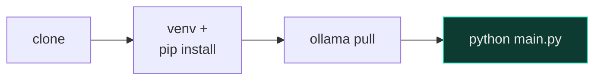

<div align="center">

# 📦 SAM — Setup Guide

<p>
  
  
  
</p>

</div>

---

## Which path is for you?

<table>
<tr>
<th width="50%">📦 A — Installer</th>
<th width="50%">🛠️ B — From source</th>
</tr>
<tr>
<td valign="top">

Most people. Double-click, click through a wizard, done.

**[Jump to Path A →](#a-installer-recommended)**

</td>
<td valign="top">

You're developing SAM or want to run it without installing anything.

**[Jump to Path B →](#b-running-from-source)**

</td>
</tr>
</table>

---

## A. Installer (recommended)

Run `SAM-Setup-x.y.z.exe`. The wizard walks through:


**Step 1 — Install location.** Defaults to `%LOCALAPPDATA%\Programs\SAM`. No administrator
rights needed.

**Step 2 — Optional tasks** (all checked by default; uncheck anything you don't want):

| Task | What it does | If you skip it |
|:--|:--|:--|
| **Install Ollama** | Downloads the official Ollama installer and runs it silently | SAM will tell you it's missing on first launch — install it later from [ollama.com](https://ollama.com/download) |
| **Download the language model** | Pre-pulls `qwen2.5:3b` (~2 GB) | It downloads on your first question instead — a one-time wait |
| **Download the speech recognition model** | Pre-downloads Whisper `small` (~500 MB) | Same — downloads on first use |
| **Start SAM when Windows starts** | Adds a startup entry | Launch SAM from the Start Menu instead |

**Step 3 — Done.** SAM launches (unless you unchecked that too).

> [!NOTE]
> If the Ollama download fails (e.g. no internet during setup), the wizard does **not**
> cancel the install — SAM installs anyway, and reports "Ollama not installed" until you
> install it yourself.

### Uninstalling

**Settings → Apps → SAM → Uninstall.** By default your configuration, logs, and the
downloaded speech model are **kept** — the uninstaller asks at the end whether to delete
them too. Ollama and its models are never touched by SAM's uninstaller (you may be sharing
them with other tools).

### First run


A small circle appears in the corner of your screen — that's SAM. Say **"Hey Sam"**, press
`Ctrl+Space`, or press `Ctrl+Shift+Space` / click the orb to type instead.

---

## B. Running from source



### 1 · Clone

```powershell
git clone https://github.com/sametgurtuna/SAM.git
cd SAM
```

### 2 · Virtual environment

```powershell
python -m venv venv
.\venv\Scripts\Activate.ps1
```

### 3 · Dependencies

```powershell
pip install --upgrade pip
pip install -r requirements.txt
```

> [!NOTE]
> The wake word model (`assets/models/hey_sam.onnx`) ships in the repo. Whisper (default
> `small`, ~500 MB) downloads automatically the first time it's needed.

### 4 · Ollama

Install from [ollama.com/download](https://ollama.com/download). You don't need to start
it manually — **SAM starts the Ollama server itself**, hidden, with no console window,
the moment it launches (`llm/ollama_service.py`). If a server is already running, SAM
leaves it alone; on exit, SAM doesn't kill it either unless you set
`llm.ollama.stop_on_exit: true`.

```powershell
ollama --version
```

### 5 · Pull a model

```powershell
ollama pull qwen2.5:3b
```

| Model | Size | Notes |
|:--|:--|:--|
| `qwen2.5:3b` | 2.0 GB | ⭐ Default — good quality/size balance |
| `qwen2.5:1.5b` | 1.0 GB | Faster, less capable |
| `llama3.2:3b` | 2.0 GB | Solid general-purpose alternative |
| `gemma2:2b` | 1.6 GB | Lighter still |

Using a different model? Update `llm.ollama.model` in `config.yaml` too.

### 6 · Run

```powershell
python main.py
```

```
  +--------------------------------------------+
  |   SAM - AI Desktop Assistant  v0.4.0        |
  |                                              |
  |   Say 'Hey Sam' to activate (voice)          |
  |   Press CTRL+SPACE   to speak                |
  |   Press CTRL+SHIFT+SPACE to type             |
  |   Press CTRL+C        to quit                |
  |                                              |
  |   LLM: Ollama (qwen2.5:3b)                   |
  |   Tray icon active (right-click for menu)    |
  +--------------------------------------------+
```

`config.yaml` is created automatically from `config.example.yaml` if it doesn't exist —
nothing is required to be set; every key has a default in `core/config.py`.

---

## 🚑 Troubleshooting

<table>
<tr><td width="30%"><b>❌ <code>No LLM engine found</code></b></td>
<td>

```powershell
ollama list          # is Ollama actually running? SAM usually starts it itself
ollama pull qwen2.5:3b
```

If the log says `Ollama is not installed`, re-run the installer with that task checked, or
install manually.

</td></tr>
<tr><td><b>❌ <code>Ctrl+Space</code> does nothing</b></td>
<td>

The `keyboard` library needs elevated rights on some systems:

```powershell
# run your terminal as Administrator, then
python main.py
```

</td></tr>
<tr><td><b>❌ Microphone not working</b></td>
<td>Check the default input device in Windows Sound settings.</td></tr>
<tr><td><b>❌ Wake word won't trigger</b></td>
<td>

```yaml
wake_word:
  threshold: 0.3    # default is 0.5
```

</td></tr>
<tr><td><b>❌ "SAM is already running"</b></td>
<td>By design — SAM allows only one instance (a named mutex), so a startup-launched copy
and a manual launch can't fight over the microphone and hotkey at once. Check your system
tray for an existing icon.</td></tr>
<tr><td><b>❌ A terminal / command prompt window flashes open</b></td>
<td>This should no longer happen — <code>cmd</code>, <code>powershell</code>, <code>wt</code>
and similar can never be opened by voice or text (see the README's Security & Privacy
section). If you still see this, please report it with <code>logs/sam.log</code>.</td></tr>
</table>

---

## Optional: Claude as a cloud fallback

If Ollama isn't available, or you'd simply rather use Claude:

1. Get an API key from [console.anthropic.com](https://console.anthropic.com)
2. Set it as an environment variable:
   ```powershell
   $env:ANTHROPIC_API_KEY = "sk-ant-..."
   ```
3. `pip install anthropic` — **not** in `requirements.txt` by default;
   `llm/claude_engine.py` imports it lazily, so Claude just stays unavailable (no crash)
   if it isn't installed.

SAM automatically falls back to Claude if Ollama can't be found.

---

## Configuration quick reference

```yaml
hotkey:
  trigger: ctrl+space
  text_input: ctrl+shift+space

wake_word:
  model: assets/models/hey_sam.onnx
  threshold: 0.5

stt:
  model: small          # tiny | base | small | medium | large-v3
  language: en

llm:
  ollama:
    model: qwen2.5:3b
    temperature: 0.7
    autostart: true       # SAM starts the Ollama server itself
    stop_on_exit: false    # never kills a server you already had running

tts:
  engine: edge-tts        # or "local" (pyttsx3 — fully offline)
  voice: en-US-GuyNeural

ui:
  orb:
    layer: auto            # stays at the bottom until called, then comes to the front
    click_through: true     # clicks outside the circle pass through to your desktop
```

Full annotated reference: [`config.example.yaml`](config.example.yaml). See also the
[README's Configuration section](README.md#-configuration).

<div align="center">

*More detail in the **[README](README.md)** and **[Architecture guide](docs/ARCHITECTURE.md)**.*

</div>
