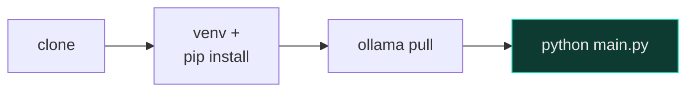

<div align="center">

# SAM Setup Guide

<p>
  
  
  
</p>

</div>

---

## Which path is for you?

<table>
<tr>
<th width="50%">A: Installer</th>
<th width="50%">B: From source</th>
</tr>
<tr>
<td valign="top">

Recommended for most users. Run the installer wizard, follow steps, done.

**[Jump to Path A](#a-installer-recommended)**

</td>
<td valign="top">

For developers or running directly in a Python virtual environment.

**[Jump to Path B](#b-running-from-source)**

</td>
</tr>
</table>

---

## A. Installer (recommended)

Run `SAM-Setup-0.4.7.exe`. The wizard walks through:


**Step 1: Install location.** Defaults to `%LOCALAPPDATA%\Programs\SAM`. No administrator rights needed.

**Step 2: Optional tasks** (checked by default):

| Task | What it does | If you skip it |
|:--|:--|:--|
| **Install Ollama** | Downloads official Ollama installer and runs silently | Install later from [ollama.com](https://ollama.com/download) |
| **Download language model** | Pre-pulls `qwen2.5:3b` (~2 GB) | Downloads automatically on first use |
| **Download speech model** | Pre-downloads Whisper `small` (~500 MB) | Downloads on first voice capture |
| **Start with Windows** | Adds a startup shortcut entry | Launch manually from Start Menu |

**Step 3: Launch.** SAM starts and sits in the system tray.

### Uninstalling

**Settings -> Apps -> SAM -> Uninstall.** Uninstaller preserves your config and downloaded models by default.

### First run


A small circle appears on your screen. Say **"Hey Sam"**, press `Ctrl+Space` to speak, or press `Ctrl+Shift+Space` (or click the orb) to type.

---

## B. Running from source



### 1. Clone

```powershell
git clone https://github.com/sametgurtuna/SAM.git
cd SAM
```

### 2. Virtual environment

```powershell
python -m venv venv
.\venv\Scripts\Activate.ps1
```

### 3. Dependencies

```powershell
pip install --upgrade pip
pip install -r requirements.txt
```

### 4. Ollama

Install from [ollama.com/download](https://ollama.com/download). **SAM starts the Ollama server automatically** if not already running.

```powershell
ollama --version
```

### 5. Pull model

```powershell
ollama pull qwen2.5:3b
```

| Model | Size | Notes |
|:--|:--|:--|
| `qwen2.5:3b` | 2.0 GB | Default - balanced speed and quality |
| `qwen2.5:1.5b` | 1.0 GB | Faster, smaller |
| `llama3.2:3b` | 2.0 GB | General alternative |
| `gemma2:2b` | 1.6 GB | Lightweight alternative |

### 6. Run

```powershell
python main.py
```

```
  +--------------------------------------------+
  |   SAM - AI Desktop Assistant  v0.4.7        |
  |                                              |
  |   Say 'Hey Sam' to activate (voice)          |
  |   Press CTRL+SPACE   to speak                |
  |   Press CTRL+SHIFT+SPACE to type             |
  |   Press CTRL+C        to quit                |
  |                                              |
  |   LLM: Ollama (qwen2.5:3b)                   |
  |   Tray icon active (right-click for menu)    |
  +--------------------------------------------+
```

---

## Troubleshooting

| Issue | Solution |
|:--|:--|
| `No LLM engine found` | Run `ollama list` and `ollama pull qwen2.5:3b` |
| `Ctrl+Space` does nothing | Run terminal as Administrator if another app captures global keys |
| Microphone not working | Verify default input device in Windows Sound settings |
| Wake word will not trigger | Lower threshold in settings (`wake_word.threshold: 0.35`) |
| SAM is already running | SAM allows only one instance via named mutex. Check system tray |

---

## Optional: Claude cloud fallback

1. Get an API key from [console.anthropic.com](https://console.anthropic.com)
2. Set environment variable:
   ```powershell
   $env:ANTHROPIC_API_KEY = "sk-ant-..."
   ```
3. Install optional SDK:
   ```powershell
   pip install anthropic
   ```

---

## Configuration summary

```yaml
hotkey:
  trigger: ctrl+space
  text_input: ctrl+shift+space

wake_word:
  model: assets/models/hey_sam.onnx
  threshold: 0.5

stt:
  model: small
  language: en

llm:
  ollama:
    model: qwen2.5:3b
    temperature: 0.7
    autostart: true
    stop_on_exit: false

tts:
  engine: edge-tts
  voice: en-US-GuyNeural

ui:
  orb:
    layer: auto
    click_through: true
```

<div align="center">

*For details, see [README.md](README.md) and [docs/ARCHITECTURE.md](docs/ARCHITECTURE.md).*

</div>
